### 👋 Hi! I'm blono

 
  
  

  

#### Development Environment

- Favorite Languages: C++/Rust/Go
- Area of Expertise: Native Windows applications using Win32 and C/C++/Rust/Go, Web applications, Cloud services (Google Cloud, AWS, Azure), Docker, Java, TypeScript, React, RDB, NoSQL, etc.
- Editor: Zed/Visual Studio Code/xyzzy/Visual Studio/Sublime Text
- Key Bindings: Emacs（のどか、Karabiner-Elements）
- AI: ChatGPT Plus, Perplexity Pro, GitHub Copilot, Gemini(Google AI Plus)
- Browser: Comet
- Shell: fish
- Terminal: iterm2
- OS: Windows 11 Pro/Mac OS
- Personal MSDN Professional subscriber
- PC: MacBook Pro 2021 16 inch/Windows 11 Pro Ryzen 7 9700X
- Keyboard: TOPRE REALFORCE
- Mouse: Logicool G PRO X SUPERLIGHT 2
- Smartphone: iPhone Air
